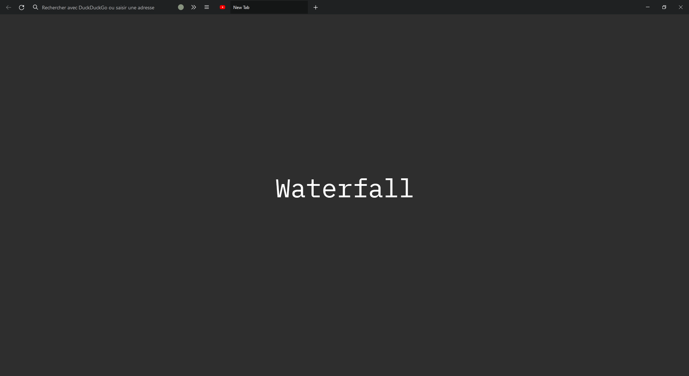
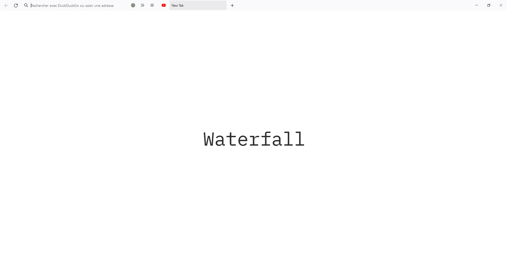

<div align="center">

# Waterfall

</div>

## Description
Waterfall is a fork of the beautiful [Cascade](https://github.com/andreasgrafen/cascade) custom CSS theme for firefox by Andreas Grafen. The aim of this fork is to make a more mouse-centered theme based on Cascade.


Some minor tweaks includes :
- tab close button on hover
- window control buttons
- hamburger menu button
- back button
- minor color changes
- inactive & active tab size


## Themes
Waterfall is available in both dark and light theme :

 

## Installation

- In the ```about:config``` page on your Firefox browser, set the following parameters to **True** :
  - ```toolkit.legacyUserProfileCustomizations.stylesheets```
  - ```layers.acceleration.force-enabled```
  - ```gfx.webrender.all```
  - ```svg.context-properties.content.enabled```
- Copy the userChrome.css file from the **DarkTheme** or the **LightTheme** folder of this repository to your **chrome** folder. You can find the **chrome** folder here :
  - On Linux : ```$HOME/.mozilla/firefox/######.default-release/chrome/```
  - On Windows : ```C:\Users\[USERNAME]\AppData\Roaming\Mozilla\Firefox\Profiles\######.default-release\chrome\```
  - On MacOS : ```Users/[USERNAME]/Library/Application Support/Firefox/Profiles/######.default-release/chrome```
  - If it doesn't exist already create a folder called chrome

## Authors:
- Andreas Grafen (original cascade theme) (https://andreas.grafen.info)
- Clément Rambaud (minor tweaks on the original file for a more mouse-centered use)
‎
‎
‎
